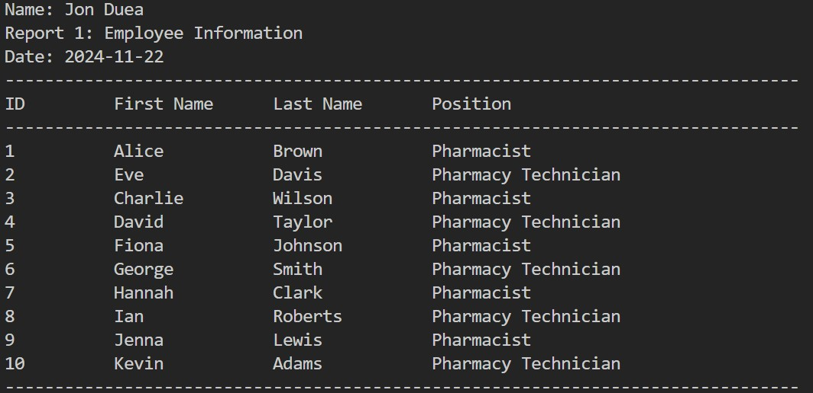
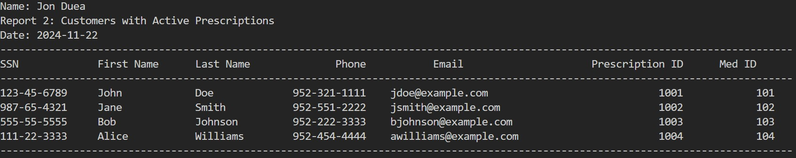
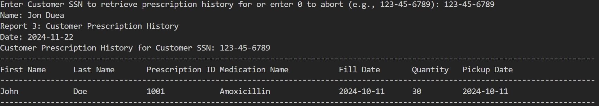

# DB Report Generator
## Introduction
This application simulates generating reports from a pharmacy database. The example reports demonstrate retrieving information like employee details, customers with active prescriptions, and prescription history for specific customers.

## Table of Contents
1. [Prerequisites](#prerequisites)
2. [Setting Up the Project](#setting-up-the-project)
2. [Setting Up the Database](#setting-up-the-database)
3. [Installing Required Python Packages](#installing-required-python-packages)
4. [Running the Application](#running-the-application)
5. [Using the Application](#using-the-application)
6. [Understanding the Reports](#understanding-the-reports)

## Prerequisites
Before running the application you will need the following installed on your computer:
1. Python 3.7 or higher
2. MySQL Community Server (8.0 or higher recommended)
3. MySQL Workbench

**Important Note:** When setting up the MySQL server the recommended root password to use is: ics311

For further help setting up Python or MySQL:
* [Beginner's Guide to Python](https://wiki.python.org/moin/BeginnersGuide)
* [Getting Started with MySQL](https://dev.mysql.com/doc/mysql-getting-started/en/)

## Setting Up the Project
1. Extract the downloaded db_report_generator.zip to it's own folder
2. Make a note of the file path to that folder for future reference.

## Setting Up the Database
### Step 1: Open MySQL Workbench
* Launch MySQL Workbench and connect to your MySQL Server.
### Step 2: Run the SQL Script:
* Open the `project_database.sql` file:
    * Go to File > Open SQL Script.
    * Navigate to the folder containing `project_database.sql` and open it.
* Execute the script:
    * Click the lightning bolt icon to run the script.
    * Wait until the script finishes executing.
* Refresh the Schemas section to confirm the database appears as `my_project`.
## Installing Required Python Packages
This application requires the `mysql-connector-python` package to interact with the MySQL database. 

### Step 1: Open Command Prompt or Terminal
* Windows: Press `Win+R`, type `cmd`, and press Enter.
* macOS/Linux: Open Terminal from your Applications.

### Step 2: Install the Package
* Enter the following command to install the package:
```
pip install mysql-connector-python
```
* Enter the following command to verify the installation:
```
pip show mysql-connector-python
```

## Running the Application
### Step 1: Verify Database Connection Details
* Open `db_report_generator.py` in a text editor or IDE
* Check the `connect()` function for accuracy:
    ```
    def connect():
        try:
            connection = mysql.connector.connect(
                host="localhost",
                user="root", 
                database="my_project",
                password="ics311", # change if needed
                auth_plugin="mysql_native_password"
            )
            if connection.is_connected():
                return connection
        except Error as e:
            print("Error while connecting to MySQL:", e)
            return None
    ```
    * Note: No changes are needed if your MySQL root password is `ics311`
* If necessary, update the connection details (e.g., username or password).
### Step 3: Run the Application
1. Navigate to the script location:
    * In Command Prompt or Terminal, navigate to the folder containing `db_report_generator.py`.
        * Example (Windows):
            ```
            cd C:\Users\Username\Downloads\db_report_generator
            ```
        * Example (macOS/Linux)
            ```
            cd /Users/Username/Downloads/db_report_generator
2. Run the script:
    * Type the following command and press Enter:
        ```
        python db_report_generator.py
        ```
## Using the Application
Upon running the application, you will see:
```    
    Welcome to DBReportGenerator today's date is: YYYY-MM-DD
    Please enter your name: 
```
* The name you enter will be the name included in the report header
* After entering a name, the options menu will be displayed.
```
    Hello, *name you entered*, lease select what you would like to do. (Enter 1, 2, 3, or 4)
    1. Report 1 (Employee Information)
    2. Report 2 (Customers with Active Prescriptions)
    3. Report 3 (Customer Prescription History)
    4. Exit
```
### Generating Reports
* Select an Option:
    * Type `1`, `2`, `3`, or `4` to select the desired action.

### Report 1: Employee Information
* Purpose: Displays a list of all employees and their positions
* Steps to generate:
    1. Enter `1` and press Enter.
    2. The report will display employee IDs, first names, last names, and positions.

### Report 2: Customers with Active Prescriptions
* Purpose: Lists customers who currently have active prescriptions.
* Steps to generate:
    1. Enter `2` and press Enter.
    2. The report will display customer information and prescription/medication ids.

### Report 3: Customer Prescription History
* Purpose: Shows the prescription history for a specific customer.
* Steps to generate:
    1. Enter `3` and press Enter.
    2. When prompted, enter the customer's SSN in the format `XXX-XX-XXXX`
        * Example: `123-45-6789`
    3. The report will display the customer's prescription history.
    4. To Abort: Enter `0` to return to the main menu.

### Exit
* Purpose: Closes the application.
* Steps:
    1. Enter `4` and press Enter.
    2. The application will exit with a goodbye message.

## Understanding the Reports

### Report 1: Employee Information
* Description: Displays all employees in the pharmacy database.
* Columns Displayed:
    * Employee ID
    * First Name
    * Last Name
    * Position (e.g., Pharmacist, Pharmacy Technician)
    


### Report 2: Customers with Active Prescriptions
* Description: Lists customers who have prescriptions that are still valid and can be filled.
* Columns Displayed:
    * Customer SSN
    * First Name
    * Last Name
    * Phone Number
    * Email Address
    * Prescription ID
    * Medication ID



### Report 3: Customer Prescription History
* Description: Shows the prescription fill history for a specific customer.
* How it works:
    * The application prompts for the customer's SSN.
    * Validates the SSN format to prevent errors.
    * Retrieves and displays the customer's filled prescriptions.
* Columns Displayed:
    * First Name
    * Last Name
    * Prescription ID
    * Medication Name
    * Fill Date
    * Quantity Filled
    * Pickup Date

